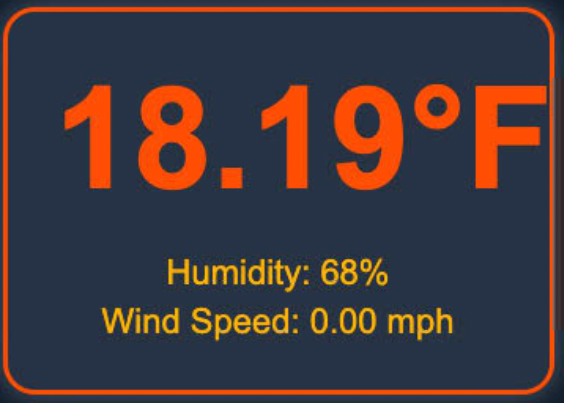

# Openweather-Widget-OBS

**Openweather-Widget-OBS** is a simple weather widget that pulls live weather data from the OpenWeather API every 10 minutes and displays it directly in OBS (Open Broadcaster Software). It runs locally on your desktop and does not require hosting or additional server setup. Simply add it as a browser source in OBS, and you're good to go!

## Features

- Fetches live weather data from the [OpenWeather API](https://openweathermap.org/api).
- Updates weather data every 10 minutes.
- Works locally on your desktop without needing any external hosting or services.
- Easy integration into OBS using a local file as a browser source.

## Requirements

- [OpenWeather API Key](https://openweathermap.org/api) (for fetching weather data).
- [OBS Studio](https://obsproject.com/) installed on your computer.

## Installation

1. **Clone or Download the Repository**  
   - Clone this repository or download the ZIP file of the project.
   
   ```bash
   git clone https://github.com/yourusername/Openweather-Widget-OBS.git
## Configuration

- **Location**: By default, the widget will display weather for a latitude and longitude. To change the location, open the `config.js` file and modify the `latitude` and `longitude` variables.

## Demo

Here’s a quick preview of how the widget will appear in OBS:


   
## Contributing

If you'd like to contribute, feel free to fork the repository, submit issues, or create pull requests for any improvements!

## License

This project is licensed under the MIT License - see the [LICENSE](https://opensource.org/license/mit) file for details.
   
   
